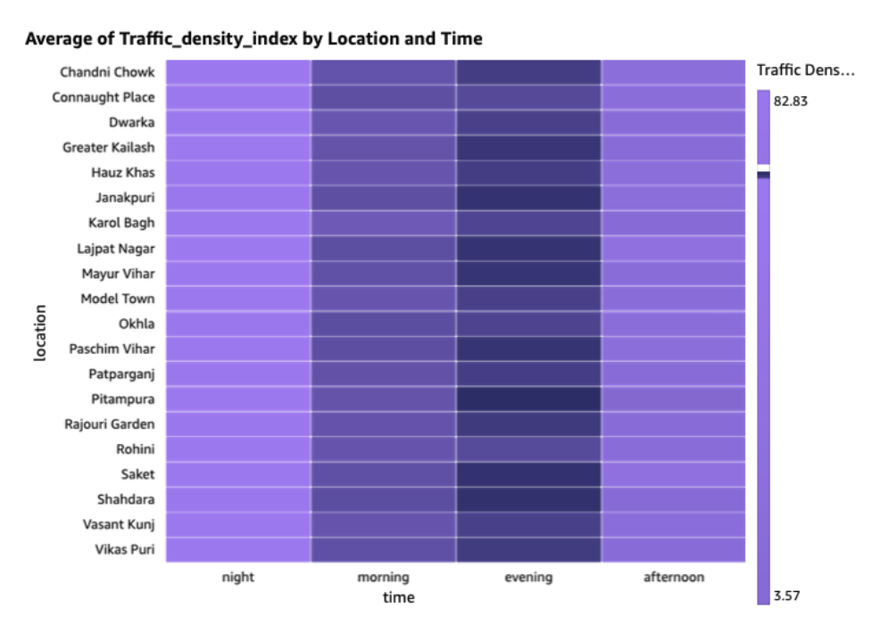
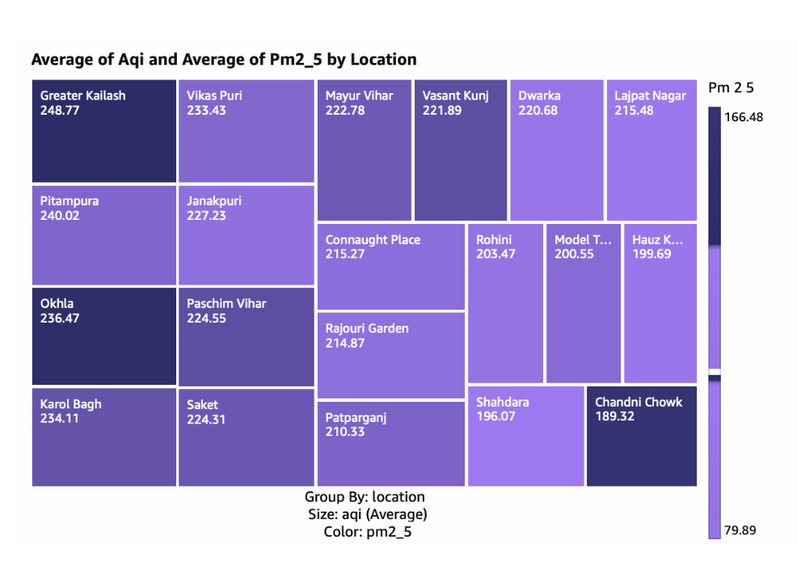
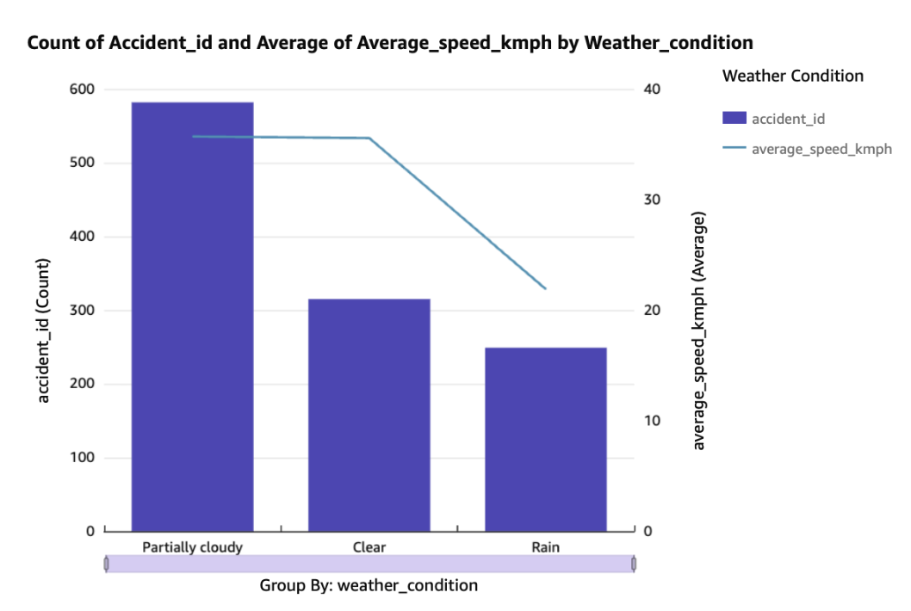
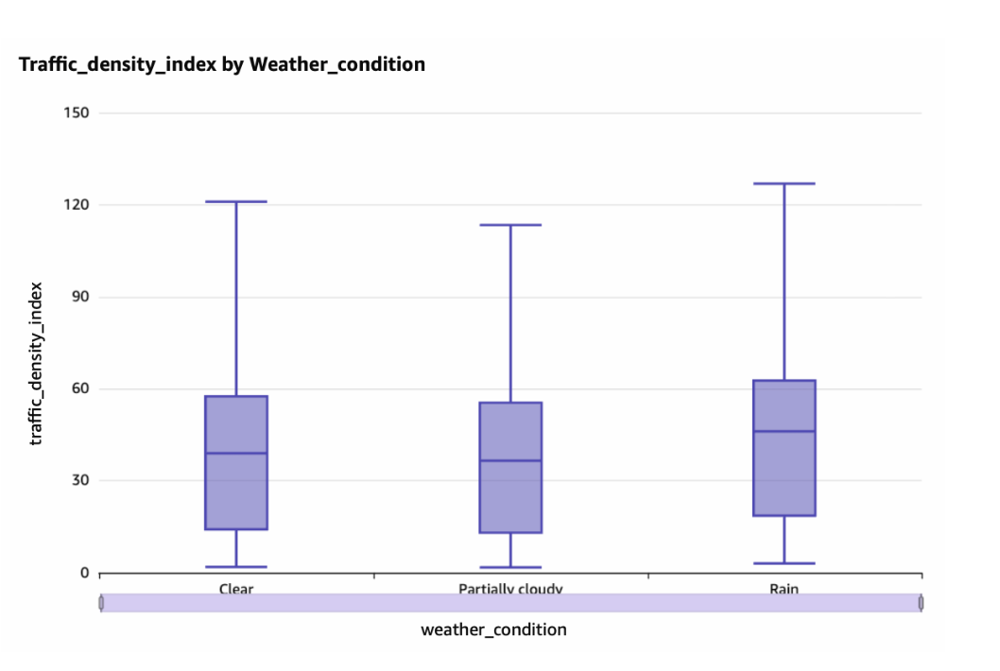
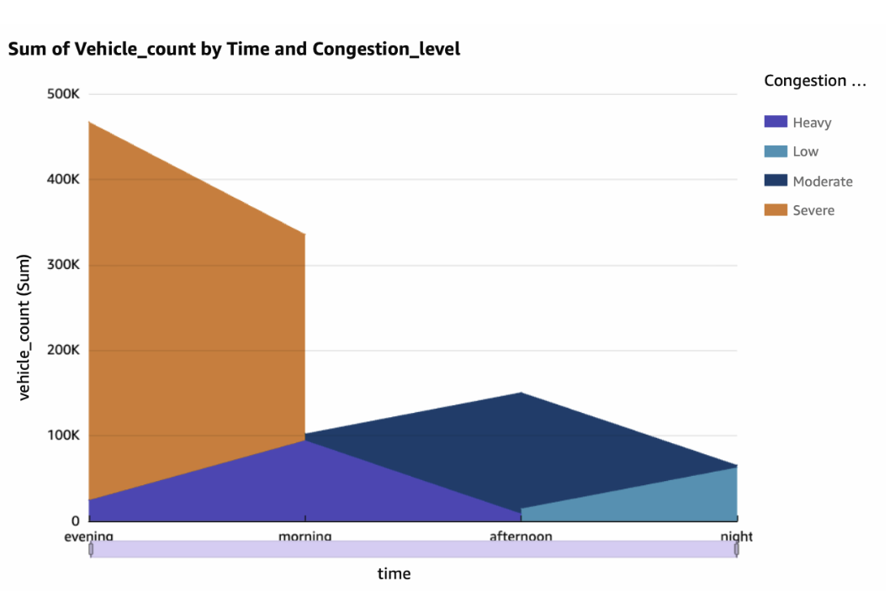
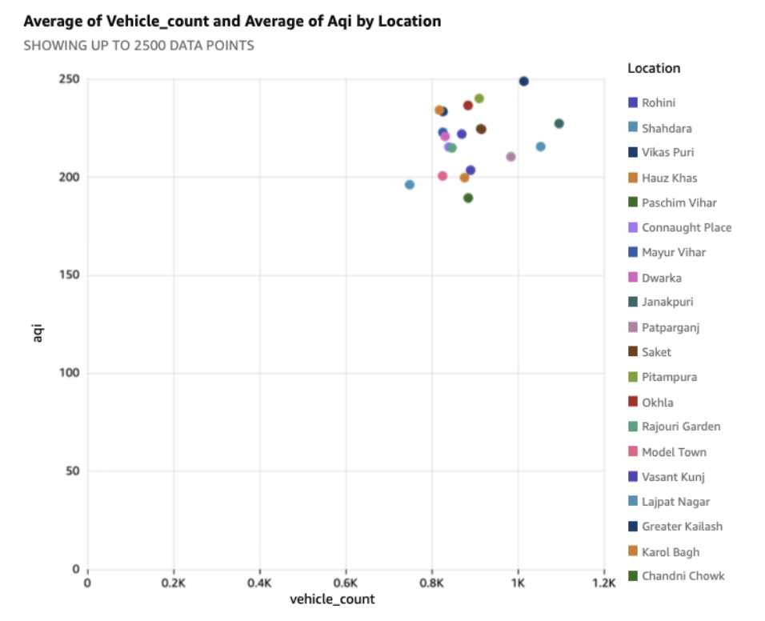

# 🚦 Delhi Smart City Transportation Analysis

## 📌 Project Overview

The **Delhi Smart City Transportation Analysis** project leverages **Amazon Web Services (AWS)** to build a scalable and serverless data lakehouse for analyzing urban transportation and environmental data.

The project integrates multiple datasets, including:

- 🚗 Traffic Data
- 🚨 Accident Data
- 🌤️ Weather Data
- 🌫️ Pollution Data

The objective is to identify traffic congestion patterns, accident hotspots, and relationships between transportation, weather conditions, and air pollution.

The project uses AWS services to automate data processing, perform SQL-based analysis, and create interactive visualizations for smart city planning and traffic management.

---

## 🎯 Objectives

- Build a scalable serverless data pipeline.
- Store raw and processed datasets using Amazon S3.
- Automate data cleaning and transformation using AWS Lambda.
- Integrate transportation and environmental datasets.
- Perform SQL-based analysis using Amazon Athena.
- Create interactive dashboards using Amazon QuickSight.
- Generate insights for smart city planning and traffic management.

---

## 🏗️ System Architecture

The project follows a serverless data lake architecture:

```text
                ┌──────────────────┐
                │   Raw Datasets   │
                │                  │
                │ Traffic          │
                │ Accidents        │
                │ Weather          │
                │ Pollution        │
                └────────┬─────────┘
                         │
                         ▼
                ┌──────────────────┐
                │    Amazon S3     │
                │    Raw Zone      │
                └────────┬─────────┘
                         │
                         ▼
                ┌──────────────────┐
                │   AWS Lambda     │
                │                  │
                │ Data Cleaning &  │
                │ Transformation   │
                └────────┬─────────┘
                         │
                         ▼
                ┌──────────────────┐
                │    Amazon S3     │
                │ Processed Zone   │
                └────────┬─────────┘
                         │
                         ▼
                ┌──────────────────┐
                │  Amazon Athena   │
                │                  │
                │ SQL Analysis &   │
                │ Data Integration │
                └────────┬─────────┘
                         │
                         ▼
                ┌──────────────────┐
                │    Amazon S3     │
                │   Curated Zone   │
                │  Master Dataset  │
                └────────┬─────────┘
                         │
                         ▼
                ┌──────────────────┐
                │ Amazon QuickSight│
                │                  │
                │ Interactive      │
                │ Dashboards       │
                └──────────────────┘
```

---

## 🔄 Data Pipeline

```
CSV Datasets
     │
     ▼
Amazon S3
(Raw Zone)
     │
     ▼
AWS Lambda
     │
     ▼
Data Cleaning & Transformation
     │
     ▼
Amazon S3
(Processed Zone)
     │
     ▼
Amazon Athena
     │
     ▼
Data Integration & SQL Analysis
     │
     ▼
Master Dataset
(Curated Zone - Parquet)
     │
     ▼
Amazon QuickSight
     │
     ▼
Interactive Dashboard & Insights
```

---

## ☁️ AWS Services Used

### 🪣 Amazon S3

Amazon S3 is used as the **central storage layer** for the project.

The data lake is organized into different zones:

- **raw-zone** – Stores the original CSV datasets.
- **processed-zone** – Stores cleaned and transformed datasets.
- **curated-zone** – Stores the integrated master dataset in Parquet format.
- **athena-results** – Stores Amazon Athena query results.

---

### ⚡ AWS Lambda

AWS Lambda is used for **automated data processing**.

The Lambda function performs the following tasks:

- Reading uploaded CSV files from Amazon S3.
- Identifying the dataset type.
- Removing empty rows.
- Handling missing values.
- Removing duplicate records.
- Cleaning numeric columns.
- Performing data validation.
- Removing outliers using the IQR method.
- Saving cleaned datasets to the processed zone.

---

### 🔍 Amazon Athena

Amazon Athena is used for **serverless SQL analysis**.

It is used to:

- Create external tables for the processed datasets.
- Query data directly from Amazon S3.
- Join Traffic, Accident, Weather, and Pollution datasets.
- Create a master dataset.
- Perform transportation and environmental analysis.

---

### 📊 Amazon QuickSight

Amazon QuickSight is used to create **interactive dashboards and visualizations**.

The dashboards provide insights into:

- Traffic density.
- Traffic congestion.
- Accident frequency.
- Accident severity.
- Weather impact on traffic.
- Vehicle volume.
- Air Quality Index (AQI).
- PM2.5 pollution levels.

---

# 🗂️ Dataset Description

The project uses **four datasets** to analyze the relationship between **traffic, road accidents, weather conditions, and air pollution in Delhi**.

---

## 🌤️ Weather Dataset (`weather.csv`)

This dataset contains meteorological conditions that may affect **traffic patterns, vehicle movement, and road safety**.

### Features

- Date
- Temperature
- Humidity
- Wind Speed
- Precipitation
- Heat Index
- Weather Conditions

---

## 🚗 Traffic Dataset (`traffic.csv`)

This dataset contains information about **traffic patterns and congestion across different locations**.

### Features

- Date
- Time
- Location
- Vehicle Count
- Average Speed
- Traffic Density Index
- Congestion Level
- Road Category

---

## 🚨 Accident Dataset (`accidents.csv`)

This dataset contains information about **road accidents and their severity**.

### Features

- Accident ID
- Date
- Time
- Location
- Vehicle Type at Fault
- Victim
- Accident Type
- Number of Killed People
- Number of Injured People
- Accident Severity

---

## 🌫️ Pollution Dataset (`pollution.csv`)

This dataset contains **air quality measurements** used to analyze the environmental impact of transportation.

### Features

- Date
- PM2.5
- PM10
- NO2
- SO2
- CO
- Air Quality Index (AQI)

---

# 🔗 Data Integration

The datasets are integrated using common attributes such as:

- **Date**
- **Time**
- **Location**

The **Traffic dataset** acts as the primary dataset for integrating and analyzing the data.

## 🔄 Relationships Analyzed

The following relationships were analyzed:

- 🚗 **Traffic congestion and air pollution**
- 🌤️ **Weather conditions and traffic patterns**
- 🚨 **Traffic density and accident frequency**
- 🌫️ **Vehicle volume and Air Quality Index (AQI)**
- 🚗 **Traffic volume and congestion levels**
- 🌧️ **Weather conditions and average vehicle speed**

---

# 📊 Data Processing

The **AWS Lambda function** performs the following data processing operations:

```text
Raw CSV File
     │
     ▼
Dataset Identification
     │
     ▼
Remove Empty Rows
     │
     ▼
Handle Missing Values
     │
     ▼
Convert Numeric Columns
     │
     ▼
Remove Invalid Values
     │
     ▼
Remove Outliers (IQR Method)
     │
     ▼
Remove Duplicate Records
     │
     ▼
Save Cleaned Dataset
     │
     ▼
Processed Zone
```

---

## 🗄️ Athena Data Model

Amazon Athena is used to create external tables for:

- delhi_accidents
- delhi_traffic
- delhi_weather
- delhi_pollution

These datasets are integrated to create:

- new_master_dataset

The master dataset combines:
```
Traffic Data
     +
Accident Data
     +
Weather Data
     +
Pollution Data
     ↓
Master Dataset
```
The curated master dataset is stored in:

- Parquet Format

This improves query performance and reduces the amount of data scanned by Amazon Athena.

---

## 📊 Dashboard Visualizations

The following dashboards were created using Amazon QuickSight.

### 🚦 Traffic Density by Location and Time

This visualization analyzes the average traffic density across different Delhi locations and time periods.
<p align="center">
  
</p>

### 🌫️ AQI and PM2.5 Analysis by Location

This visualization compares Air Quality Index (AQI) and PM2.5 levels across different locations.
<p align="center">
  
</p>

### 🚨 Accident Count and Average Speed by Weather Condition

This visualization analyzes the relationship between weather conditions, accident frequency, and average vehicle speed.
<p align="center">
  
</p>

### 🌤️ Traffic Density by Weather Condition

This visualization shows how traffic density varies under different weather conditions.
<p align="center">
  
</p>

### 🚗 Vehicle Count by Time and Congestion Level

This visualization analyzes vehicle volume at different times of the day based on congestion levels.
<p align="center">
  
</p>

### 🌍 Vehicle Count vs AQI by Location

This visualization compares average vehicle count and Air Quality Index across different locations.
<p align="center">
  
</p>

---

# 📈 Key Insights

The analysis generated several valuable insights:

- 🚗 **Traffic congestion** varies across different locations and times of the day.
- 🌆 **Morning and evening periods** contribute significantly to overall vehicle volume.
- 🚨 Certain locations emerge as major **accident hotspots**.
- 🌤️ **Weather conditions** influence traffic density and average vehicle speed.
- 🌧️ **Accident frequency** varies under different weather conditions.
- 🌫️ Locations with higher vehicle activity can experience **higher pollution levels**.
- 📊 **PM2.5 and AQI levels** vary across different locations in Delhi.
- 🚦 **Congestion levels** significantly affect vehicle movement patterns.

---

# 🛠️ Technologies Used

## ☁️ Cloud Services

- Amazon Web Services (AWS)
- Amazon S3
- AWS Lambda
- Amazon Athena
- Amazon QuickSight

## 🐍 Programming and Data Processing

- Python
- Pandas
- AWS SDK for Pandas (AWS Wrangler)

## 🔍 Data Querying

- SQL

## 💾 Data Storage

- CSV
- Apache Parquet

---

## 📂 Project Structure

```
Delhi-Smart-City-Transportation-Analysis/
│
├── README.md
│
├── data/
│   ├── accidents.csv
│   ├── pollution.csv
│   ├── traffic.csv
│   └── weather.csv
│
├── lambda/
│   └── lambda_function.py
│
├── athena/
│   ├── 01_create_database.sql
│   ├── 02_create_accidents_table.sql
│   ├── 03_create_traffic_table.sql
│   ├── 04_create_pollution_table.sql
│   ├── 05_create_weather_table.sql
│   ├── 06_create_master_table.sql
│   └── 07_analysis_queries.sql
│
├── architecture/
│   └── architecture_diagram.png
│
├── dashboards/
│   ├── traffic_vs_location.png
│   ├── aqi_vs_location.png
│   ├── accident_and_speed_vs_weather.png
│   ├── traffic_vs_weather.png
│   ├── vehicle_count_vs_time.png
│   └── vehicle_count_vs_aqi_vs_location.png
│
└── documentation/
    └── AWS_ProjectReport.pdf
```
---

## 🚀 Project Workflow

```
Step 1
│
├── Upload raw datasets to Amazon S3
│
▼
Step 2
│
├── Trigger AWS Lambda
│
▼
Step 3
│
├── Clean and transform datasets
│
▼
Step 4
│
├── Store cleaned data in Processed Zone
│
▼
Step 5
│
├── Create external tables using Amazon Athena
│
▼
Step 6
│
├── Perform SQL analysis
│
▼
Step 7
│
├── Create Master Dataset
│
▼
Step 8
│
├── Store curated data in Parquet format
│
▼
Step 9
│
└── Create interactive dashboards using Amazon QuickSight
```

---

## 🚀 Future Scope

The project can be extended in the future by implementing the following features:

- 🤖 Integrating **Amazon SageMaker** for traffic prediction.
- 📊 Developing machine learning models to predict traffic congestion.
- 🚨 Predicting accident-prone locations.
- 🔄 Implementing real-time data streaming.
- 🚗 Integrating real-time traffic APIs.
- 🌦️ Integrating real-time weather data.
- 📡 Using **AWS IoT Greengrass** for edge computing.
- 🔗 Developing APIs for real-time traffic and weather information.
- 🔔 Creating automated alerts for high congestion and accident-prone areas.

---

## 📄 Project Report

The complete project documentation is available in the following file:

### 📄 View Project Report

[📥 Click Here to View the Complete Project Report](documentation/AWS_ProjectReport.pdf)

> **Note:** Make sure the filename inside the `documentation` folder exactly matches `AWS_ProjectReport.pdf`. If your actual filename is different, update the link above accordingly.

---

## 👨‍💻 Author

**Gaurav Kumar**

---

## ⭐ Support

If you found this project interesting or useful, feel free to **star ⭐ the repository!**
